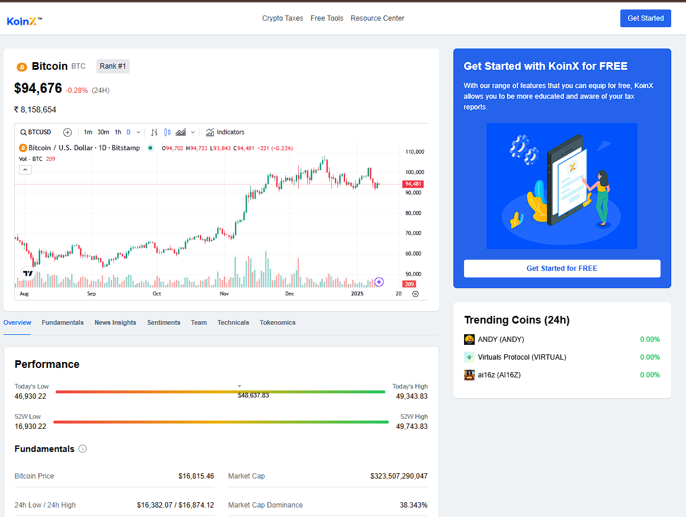
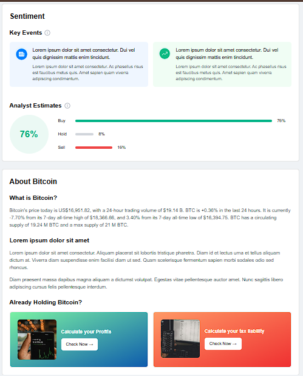
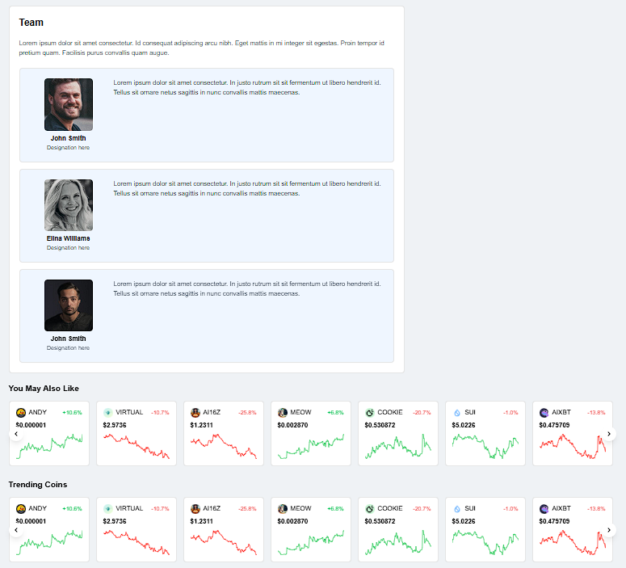

# Cryptocurrency Dashboard

This React application displays a cryptocurrency dashboard with the following features:

*   **Crypto Overview:** Shows current Bitcoin (BTC) price in USD and INR, along with 24-hour price change and rank.
*   **Performance:** Displays a visual indicator of today's high and low BTC price.
*   **Tokenomics:** Illustrates the initial distribution of BTC tokens (currently a placeholder, integration with `recharts` is explained).
*   **TradingView Widget:** Displays an interactive BTC price chart using TradingView.
*   **Team Section:** Showcases team members with descriptions.
*   **Trending and "You May Also Like" Coins:** Displays trending coins and other coins the user might be interested in.

**Live Demo**

See the deployed version of the cryptocurrency dashboard at: [https://678259be35747672840c88fe--lambent-smakager-7499f2.netlify.app/](https://678259be35747672840c88fe--lambent-smakager-7499f2.netlify.app/)

**Website Preview**

Here are some screenshots showcasing the application's interface:

<p align="center">
  
  
  
</p>

## Getting Started

1.  **Clone the repository:**

    ```bash
    git clone [https://github.com/AnubhavDubey23/cryptocurrency-dashboard.git](https://github.com/AnubhavDubey23/cryptocurrency-dashboard.git)
    ```

2.  **Install dependencies:**

    ```bash
    cd cryptocurrency-dashboard
    npm install
    ```

3.  **Run the application:**

    ```bash
    npm run dev
    ```

    This will start the development server and open the application in your default browser at http://localhost:3000/.

## Explanation of Code

The codebase consists of several React components:

*   **`cryptoOverview.tsx`:** Fetches live Bitcoin price data from CoinGecko and displays it with the 24-hour change and rank.
*   **`performance.tsx`:** This component is a static representation of performance and does not fetch data.
*   **`tokenomics.tsx`:** This component currently holds a placeholder for a chart and some descriptive text. You'll integrate the `recharts` library here to create a functional chart.
*   **`tradingViewWidget.tsx`:** This component embeds a TradingView chart for BTC using their JavaScript API.
* **`team.tsx`:** Displays information about team members.
* **`YouMayLike.tsx` and `TrendingCoins.tsx`:** Display trending coins and coins the user might be interested in, using data fetched from the CoinGecko API.

## Using `recharts` for Tokenomics Chart

While `tokenomics.tsx` includes placeholder text, you can use the `recharts` library to create a chart representing the token distribution. Here's a general guideline (refer to `recharts` documentation for specifics):

1.  Install `recharts`:

    ```bash
    npm install recharts
    ```

2.  Import necessary components from `recharts` *using dynamic imports*:

    ```javascript
    import dynamic from 'next/dynamic';
    import type { PieChartProps, PieProps, CellProps } from 'recharts';

    const PieChart = dynamic<PieChartProps>(() => import('recharts').then(mod => mod.PieChart), { ssr: false });
    const Pie = dynamic<PieProps>(() => import('recharts').then(mod => mod.Pie), { ssr: false });
    const Cell = dynamic<CellProps>(() => import('recharts').then(mod => mod.Cell), { ssr: false });
    ```

3.  Structure your chart data:

    ```javascript
    const data = [
        { name: "Crowdsale investors", value: 80 },
        { name: "Foundation", value: 20 }
    ];
    ```

4.  Render the chart using `PieChart`, `Pie`, and `Cell` components with appropriate props (refer to `recharts` documentation). Example:

    ```jsx
    <PieChart width={200} height={200}>
        <Pie data={data} dataKey="value" cx="50%" cy="50%" outerRadius={80} fill="#8884d8">
            {data.map((entry, index) => (
                <Cell key={`cell-${index}`} fill={COLORS[index % COLORS.length]} />
            ))}
        </Pie>
    </PieChart>
    ```

## Additional Notes

*   This project uses `next/image` for optimized image loading. Ensure you have Next.js configured if you plan to deploy this as a production application.
*   The TradingView widget uses their JavaScript API to display the chart. Refer to their documentation for customization options.
